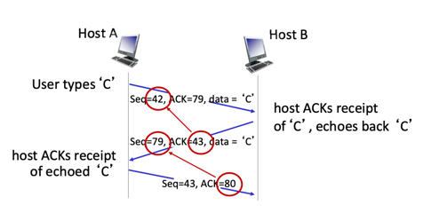
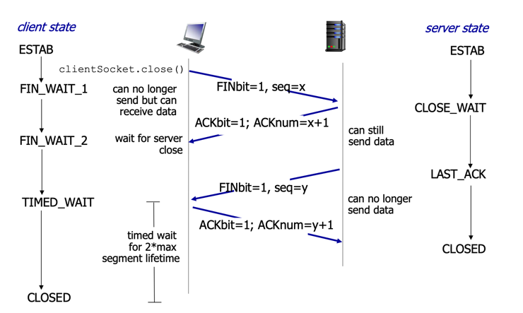
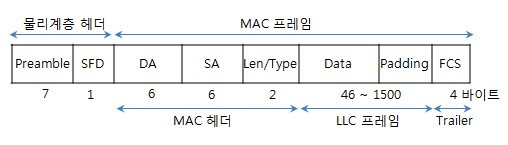

# Section 1. 네트워크의 기초
`노드와 링크가 서로 연결되어 있거나 연결되어 있으며 리소스를 공유하는 집합`
- 노드는 서버, 라우터, 스위치 등 네트워크 장비를 의미하고 링크는 유선 또는 무선을 의미한다.

## 1.1 처리량과 지연 시간
### 처리량 (throughput)
`링크 내에서 성공적으로 전달된 데이터의 양`
- 얼만큼의 트래픽을 처리했는지를 나타내는 양
- 단위 : `bps (bits per second)`
- 트래픽, 네트워크 장치 간의 대역폭, 네트워크 중간에 발생하는 에러, 장치의 하드웨어 스펙에 영향 받음
- Bottleneck link → 더 작은 링크의 throughput 에 따라 전체 (end to end) throughput 이 영향을 받을 때 해당 링크를 bottleneck link 라고 함
### 트래픽
`특정 시점에 링크 내에 흐르는 데이터의 양`
- 예를 들어 서버에 저장된 파일을 클라이언트가 다운로드할 때 발생되는 데이터의 누적량
### 대역폭
`주어진 시간 동안 네트워크 연결을 통해 흐를 수 있는 최대 비트 수`
### 지연 시간
`요청이 처리되는 시간`, `어떤 메시지가 두 장치 사이를 왕복하는 데 걸리는 시간`
- 매체 타입 (무선, 유선), 패킷 크기, 라우터의 패킷 처리 시간에 영향 받음 

## 1.2 네트워크 토폴로지와 병목 현상
### 네트워크 토폴로지
`노드와 링크가 어떻게 배치되어 있는지에 대한 방식이자 연결 형태`
- 트리 토폴로지
  - 계층형 토폴로지이자 트리 형태로 배치한 네트워크 구성을 의미
  - 노드의 추가, 삭제가 쉽다 (+)
  - 특정 노드에 트래픽이 집중될 때 하위 노드에 영향을 끼칠 수 있다 (-)
- 버스 토폴로지
  - 중앙 통신 회선 하나에 여러 개의 노드가 연결되어 공유하는 네트워크 구성
  - 근거리 통신망 (LAN) 에서 사용
  - 설치 비용이 적고 신뢰성이 우수하며 중앙 통신 회선에 노드를 추가하거나 삭제하기 쉽다 (+)
  - 스푸핑이 가능하다 (-) 
    - 스푸핑 : `LAN 상에서 송신부의 패킷을 송신과 관련 없는 다른 호스트에 가지 않도록 하는 스위칭 기능을 마비시키거나 속여서 특정 (악의적인) 노드에 해당 패킷이 오도록 처리하는 것`
- 스타 토폴로지
  - 중앙에 있는 노드에 모두 연결된 네트워크 구성
  - 노드를 추가하거나 에러를 탐지하기 쉽고 충돌 발생 가능성이 적다 (+)
  - 한 노드에 장애가 발생해도 쉽게 에러를 발견할 수 있으며 장애 노드가 중앙 노드가 아닐 경우 다른 노드에 영향을 끼치는 것이 적다 (+)
  - 중앙 노드에 장애가 발생하면 전체 네트워크를 사용할 수 없고 고가이다. (-)
- 링형 토폴로지
  - 각각의 노드가 양 옆의 두 노드와 연결하여 전체적으로 고리처럼 하나의 연속된 길을 통해 통신을 하는 망 구성
  - 데이터는 노드에서 노드로 이동을 하며, 각각의 노드는 고리 모양의 길을 통해 패킷을 처리
  - 노드 수가 증가되어도 네트워크 상의 손실이 거의 없고 충돌이 발생될 가능성이 적으며 노드의 고장 발견을 쉽게 찾을 수 있다 (+)
  - 네트워크 구성 변경이 어렵고 회선에 장애가 발생하면 전체 네트워크에 영향을 끼친다 (-)
- 메시 토폴로지
  - 망형 토폴로지라고도 불리며, 그물망처럼 연결된 구조를 가진다
  - 한 단말 장치에 장애가 발생해도 여러 개의 경로가 존재하므로 네트워크를 계속 사용할 수 있다 (+)
  - 트래픽 분산 처리가 가능하다 (+)
  - 노드의 추가가 어렵고 구축 비용과 운용 비용이 비싸다 (-)
### 병목 현상 (Bottleneck)
`전체 시스템의 성능이나 용량이 하나의 구성 요소로 인해 제한을 받는 현상`

## 1.3 네트워크 분류
네트워크는 그 규모에 따라 LAN, MAN, WAN 으로 나뉜다.

### LAN (Local Area Network)
- 근거리 통신망, 사무실과 개인적으로 소유 가능한 규모
- 전송 속도가 빠르고 혼잡하지 않다
### MAN (Metropolitan Area Network)
- 대도시 지역 네트워크, 도시 같은 넓은 지역에서 운영
- 전송 속도는 평균이며 LAN 보다 혼잡
### WAN (Wide Area Network)
- 광역 네트워크, 국가 또는 대륙 같은 더 넓은 지역에서 운영
- 전송 속도는 낮으며 MAN 보다 혼잡

## 1.4 네트워크 성능 분석 명령어
- 네트워크 병목 현상의 주된 원인
  - 네트워크 대역폭
  - 네트워크 토폴로지
  - 서버 CPU, 메모리 사용량
  - 비효율적인 네트워크 구성
### ping
- Packet INternet Groper 
- 네트워크 상태를 확인하려는 대상 노드를 향해 일정 크기의 패킷을 전송하는 명령어
- 해당 노드의 패킷 수신 상태와 도달하기까지의 시간 등을 확인 가능
- TCP/IP 프로토콜 중 ICMP 프로토콜을 통해 동작
- `ping www.google.com -n 12`

### netstat
- 접속되어 있는 서비스들의 네트워크 상태를 표시하는 데 사용
- 네트워크 접속, 라우팅 테이블, 네트워크 프로토콜 등 리스트를 보여준다
- 주로 서비스의 포트가 열려있는지 확인할 때 사용

### nslookup
- DNS 에 관련된 내용을 확인하기 위해 쓰는 명령어
- 특정 도메인에 매핑된 IP를 확인하기 위해 사용

### tracert / traceroute
- 윈도우에서는 tracert 리눅스에서는 traceroute
- 목적지 노드까지 네트워크 경로를 확인할 때 사용하는 명령어
- 목적지 노드까지의 구간들 중 어느 구간에서 응답 시간이 느려지는지 등을 확인 가능

## 1.5 네트워크 프로토콜 표준화
`네트워크 프로토콜이란 다른 장치들끼리 데이터를 주고받기 위해 설정된 공통된 인터페이스`
- 네트워크 프로토콜은 IEEE 또는 IETF 와 같은 표준화 단체가 정한다

---

# Section 2. TCP/IP 4계층 모델
- 인터넷 프로토콜 스위트 : `인터넷에서 컴퓨터들이 서로 정보를 주고받는 데 쓰이는 프로토콜의 집합`
- TCP/IP 4계층 또는 OSI 7계층 모델로 설명

## 2.1 계층 구조
- 특정 계층이 변경되었을 때 다른 계층이 영향을 받지 않도록 설계 
  - Transport Layer 에서 TCP 를 UDP 로 변경했다고 해서 인터넷 웹 브라우저를 다시 설치할 필요 X
### Application Layer
FTP, HTTP, SSH, SMTP, DNS 등 `응용 프로그램이 사용되는 프로토콜 계층`
#### FTP 
장치와 장치 간의 파일을 전송하는 데 사용되는 표준 통신 프로토콜
#### SSH
보안되지 않은 네트워크에서 네트워크 서비스를 안전하게 운영하기 위한 암호화 네트워크 프로토콜
#### HTTP
World Wide Web 을 위한 데이터 통신의 기초이자 웹 사이트를 이용하는 데 쓰는 프로토콜
#### SMTP
전자 메일 전송을 위한 인터넷 표준 통신 프로토콜
#### DNS
도메인 이름과 IP 주소를 매핑해주는 서버
- 예를 들어 `www.naver.com` 에 DNS 쿼리가 오면 (로컬 DNS 캐시를 확인 후 없을 경우) `[Root DNS]` → `[.com DNS]` → `[.naver DNS]` → `[www DNS]` 과정을 거쳐 완벽한 주소를 찾아 IP 주소를 매핑한다 
- 모든 DNS 서버는 DNS recursor, Root Name Server, TLD Name Server, SLD Name (Authoritative) Server 로 분류된다

### Transport Layer
송신자와 수신자를 연결하는 통신 서비스를 제공하며 연결 지향 데이터 스트림 지원, 신뢰성, 흐름 제어 제공 
애플리케이션과 인터넷 계층 사이의 데이터 중계 역할
- TCP
  - 패킷 사이의 순서 보장
  - 연결 지향 프로토콜 사용 → 신뢰성 구축, 수신 여부 확인
  - 가상회선 패킷 교환 방식 사용
- UDP 
  - 패킷 사이 순서 보장 X
  - 수신 여부 확인 X
  - 데이터그램 패킷 교환 방식 사용
#### 가상회선 패킷 교환 방식
`각 패킷에 가상회선 식별자가 포함되며 모든 패킷을 전송하면 가상회선이 해제되고 패킷들은 전송된 순서대로 도착하는 방식`
#### 데이터그램 패킷 교환 방식
`패킷이 독립적으로 이동하며 최적의 경로를 선택하여 가는데, 하나의 메시지에서 분할된 여러 패킷은 서로 다른 경로로 전송될 수 있으며 도착한 순서가 다를 수 있는 방식`
#### TCP 연결 성립 과정 (3-way handshake)

1. SYN 단계  
클라이언트는 서버에 클라이언트의 ISN을 담아 SYN을 보낸다 
2. SYN + ACK 단계  
서버는 클라이언트의 SYN을 수신하고 서버의 ISN을 보내며 승인 번호로 클라이언트의 ISN + 1을 보낸다
3. ACK 단계  
클라이언트는 서버의 ISN + 1 한 값인 승인 번호를 담아 ACK 을 서버에 보낸다
#### TCP 연결 해제 과정 (4-way handshake)

1. 클라이언트가 연결을 닫으려고 할 때 FIN 으로 설정된 세그먼트를 보낸다. 그리고 클라이언트는 `FIN_WAIT_1` 상태로 들어가고 서버의 응답을 기다린다
2. 서버는 클라이언트로 ACK 이라는 승인 세그먼트를 보낸다. 그리고 `CLOSE_WAIT` 상태로 들어간다. 클라이언트는 세그먼트를 받으면 `FIN_WAIT_2` 상태에 들어간다
3. 서버는 ACK 을 보내고 일정 시간이 지난 이후에 클라이언트에 FIN 이라는 세그먼트를 보낸다
4. 클라이언트는 `TIME_WAIT` 상태가 되고 다시 서버로 ACK 을 보내서 서버는 `CLOSED` 상태가 된다. 
   > 지연 패킷이 발생할 경우를 대비하고 두 장치가 연결이 닫혔는지 확인하기 위해 TIME_WAIT 상태에서 잠시 기다린다.
   
### Internet Layer
장치로부터 받은 네트워크 패킷을 IP 주소로 지정된 목적지로 전송하기 위해 사용되는 계층 
IP, ARP, ICMP 등이 있으며 패킷을 수신해야 할 상대의 주소를 지정하여 데이터를 전달 
상대방이 제대로 받았는지에 대해 보장하지 않는 비연결형적인 특징을 가짐

### Link Layer
전선, 광섬유, 무선 등으로 실질적으로 데이터를 전달하며 장치 간에 신호를 주고받는 '규칙'을 전하는 계층 
- 물리 계층 : 무선 LAN과 유선 LAN을 통해 0과 1로 이루어진 데이터를 보내는 계층
- 데이터 링크 계층 : '이더넷 프레임'을 통해 에러 확인, 흐름 제어, 접근 제어를 담당하는 계층
#### 유선 LAN (IEEE802.3)
유선 LAN을 이루는 이더넷은 IEEE802.3이라는 프로토콜을 따르며 전이중화 통신 사용
##### 전이중화 통신 (full duplex)
`양쪽 장치가 동시에 송수신할 수 있는 방식` 
현대의 고속 이더넷은 이 방식을 기반으로 통신
##### CSMA / CD
`데이터를 보낸 이후 충돌이 발생한다면 일정 시간 이후 재전송하는 방식` 
이전에는 유선 LAN에 반이중화 통신 중 하나인 CSMA/CD 방식을 사용했었음
#### 유선 LAN을 이루는 케이블
TP 케이블과 광섬유 케이블이 대표적
##### 트위스트 페어 케이블
하나의 케이블처럼 보이지만 실제로는 여덟 개의 구리선을 두 개씩 꼬아서 묶은 케이블
##### 광섬유 케이블
광섬유로 만든 케이블. 레이저를 이용해서 통신하기 때문에 장거리 및 고속 통신 가능 
빛의 굴절률이 높은 부분인 코어와 낮은 부분인 클래딩으로 이루어져 있다
#### 무선 LAN(IEEE802.11)
무선 LAN 장치는 수신과 송신에 같은 채널을 사용하기 때문에 반이중화 통신 사용
##### 반이중화 통신 (half duplex)
`양쪽 장치는 서로 통신할 수 있지만, 동시에는 통신할 수 없으며 한번에 한 방향만 통신할 수 있는 방식` 
둘 이상의 장치가 동시에 전송하면 충돌이 발생하여 메시지가 손실되거나 왜곡될 수 있기 때문에 충돌 방지 시스템 필요
##### CSMA / CA
`장치에서 데이터를 보내기 전에 일련의 과정을 기반으로 사전에 가능한 한 충돌을 방지하는 방식` 
#### 무선 LAN을 이루는 주파수
무선 LAN (WLAN, Wireless Local Area Network) 란 무선 신호 전달 방식을 이용해 2대 이상의 장치를 연결하는 기술 
비유도 매체인 공기에 주파수를 쏘아 무선 통신망을 구축하며, 주파수 대역으로 2.4GHz 대역 또는 5GHz 대역 중 하나를 써서 구축
- 2.4GHz는 장애물에 강한 특성을 보이지만 전자레인지, 무선 등 전파 간섭이 일어나는 경우가 많음
- 5GHz는 사용할 수 있는 채널 수도 많고 동시에 사용할 수 있기 때문에 상대적으로 깨끗한 전파 환경을 구축할 수 있음
##### 와이파이
`전자기기들이 무선 LAN 신호에 연결할 수 있게 하는 기술` 
사용하기 위해서 AP (Access Point), 공유기가 있어야 함. 이를 통해 유선 LAN에 흐르는 신호를 무선 LAN 신호로 바꿔주어 신호가 닿는 범위 내에서 무선 인터넷을 사용할 수 있게됨
##### BSS (Basic Service Set)
`기본 서비스 집합. 단순 공유기를 통해 네트워크에 접속하는 것이 아닌 동일 BSS 내에 있는 AP들과 장치들이 서로 통신이 가능한 구조` 
- 근거리 무선 통신 제공
- 하나의 AP만을 기반으로 구축되어 있어 사용자가 한 곳에서 다른 곳으로 자유롭게 이동하며 네트워크 접속 X
##### ESS (Extended Service Set)
`하나 이상의 연결된 BSS 그룹` 
- 장거리 무선 통신 제공
- BSS보다 더 많은 가용성과 이동성
- 사용자는 한 장소에서 다른 장소로 이동하며 중단 없이 네트워크 연결 가능
#### 이더넷 프레임

- `Preamble` : 이더넷 프레임이 시작임을 알림
- `SFD (Start Frame Delimiter)` : 다음 바이트부터 MAC 주소 필드가 시작임을 알림
- `DMAC` / `SMAC` : 수신, 송신 MAC 주소
- `EtherType` : 데이터 계층 위의 계층인 IP 프로토콜을 정의
- `Payload`
- `CRC` : 에러 확인 비트

### 계층 간 데이터 송수신 과정
캡슐화 과정과 비캡슐화 과정을 거쳐 데이터가 전송된다.
#### 캡슐화 과정
`상위 계층의 헤더와 데이터를 하위 계층의 데이터 부분 (payload)에 포함시키고 해당 (하위) 계층의 헤더를 삽입하는 과정` 
애플리케이션 계층의 데이터가 전송 계층으로 전달되며 '세그먼트' 또는 '데이터그램'화 되며 TCP 헤더가 붙여지는 것이 캡슐화 과정
#### 비캡슐화 과정
`하위 계층에서 상위 계층으로 가며 각 (하위) 계층의 헤더 부분을 제거하는 과정` 

## 2.2 PDU (Protocol Data Unit)
`네트워크의 어떠한 계층에서 계층으로 데이터가 전달될 때 한 덩어리의 단위. 제어 관련 정보들이 포함된 헤더와 데이터를 의미하는 페이로드로 구성되어있다.` 
- Application Layer : 메시지
- Transport Layer : 세그먼트 (TCP) / 데이터그램 (UDP)
- Internet Layer : 패킷
- Link Layer : 프레임 (데이터 링크 계층) / 비트 (물리 계층)
- PDU 중 비트로 송수신하는 것이 모든 PDU 중 가장 빠르고 효율성이 높다.
---
# Section 3. 네트워크 기기

## 3.1 네트워크 기기의 처리 범위
네트워크 기기는 계층 별로 처리 범위를 나눌 수 있다. 
상위 계층을 처리하는 기기는 하위 계층을 처리 가능하지만 그 반대는 불가
- Application Layer : `L7 Switch`
- Internet Layer : `L3 Switch`
- DataLink Layer : `L2 Switch` / `Bridge`
- Physical Layer : `NIC` / `Repeater` / `AP`

## 3.2 애플리케이션 계층을 처리하는 기기
### L7 스위치
스위치 : `여러 장비를 연결하고 데이터 통신을 중재하며 목적지가 연결된 포트로만 전기 신호를 보내 데이터를 전송하는 통신 네트워크 장비` 
- L7 스위치는 `로드밸런서` 라고도 하며, 서버의 부하를 분산하는 기기
- URL, 서버, 캐시, 쿠키들을 기반으로 트래픽 분산
- 바이러스, 불필요한 외부 데이터 등을 걸러내는 필터링 기능과 응용 프로그램 수준의 모니터링도 가능
- 정기적인 `헬스 체크`를 이용해 감시하면서 장애가 발생한 서버가 있다면 트래픽 분산 대상에서 제외시킴

#### L4 스위치와의 차이
- 로드밸런서로 L4 스위치도 존재하지만, L4 스위치는 전송 계층을 처리하는 기기로 스트리밍 관련 서비스에서는 사용 X
- 메시지를 기반으로 인식 X IP와 (특히) 포트를 기반으로 트래픽 분산, 반면 L7 스위치는 둘 외에도 URL, HTTP 헤더, 쿠키 등을 기반으로 트래픽 분산
- 클라우드 서비스에서 L7 스위치를 이용한 로드밸런싱은 ALB 컴포넌트로, L4 스위치를 이용한 로드밸런싱은 NLB 컴포넌트로 함

#### 헬스 체크
`전송 주기와 재전송 횟수 등을 설정한 이후 반복적으로 서버에 요청을 보내는 것` 

#### 로드밸런서를 이용한 서버 이중화
로드밸런서의 대표적인 기능으로, 로드밸런서는 2대 이상의 서버를 기반으로 가상 IP를 제공하고 이를 기반으로 안정적인 서비스를 제공함 
Ex. 사용자들은 로드밸런서가 제공한 `0.0.0.12010` 이란 가상 IP로 접근, 로드밸런서는 뒷단에 사용 가능한 서버인 `0.0.0.12011` 와 `0.0.0.12012` 를 기반으로 서빙

## 3.3 인터넷 계층을 처리하는 기기
### 라우터
라우팅 : `다른 네트워크에 존재하는 장치끼리 서로 데이터를 주고받을 때 패킷 소모를 최소화하고 경로를 최적화하여 최소 경로로 패킷을 포워딩`  
라우터 : `여러 개의 네트워크를 연결, 분할, 구분시켜주는 역할을 하는 라우팅 장비`

### L3 스위치
- L2 스위치의 기능과 라우팅 기능을 갖춘 장비
- 라우터는 소프트웨어 기반 라우팅과 하드웨어 기반 라우팅으로 나뉘어지고, 하드웨어 기반 라우팅을 담당하는 장치가 L3 스위치

## 3.4 데이터 링크 계층을 처리하는 기기
### L2 스위치
- 장치들의 MAC 주소를 MAC 주소 테이블을 통해 관리
- 연결된 장치로부터 패킷이 왔을 때 패킷 전송을 담당
- IP 주소 기반 라우팅 불가. MAC 주소 기반 스위칭 담당
### 브리지
- 두 개의 근거리 통신망(LAN)을 상호 접속할 수 있도록 하는 통신망 연결 장치
- 포트와 포트 사이의 다리 역할을 하며, 장치에서 받아온 MAC 주소를 MAC 주소 테이블로 관리
- 통신망 범위를 확장하고 서로 다른 LAN 등으로 이루어진 하나의 통신망을 구축할 때 사용

## 3.5 물리 계층을 처리하는 기기
### NIC (Network Interface Card)
- 2대 이상의 컴퓨터 네트워크를 구성하는데 사용하며, 네트워크와 빠른 속도로 데이터를 송수신할 수 있도록 컴퓨터 내에 설치하는 확장 카드 (LAN 카드)
- 각 LAN 카드에는 고유 식별 번호인 MAC 주소가 있음
### 리피터
- 들어오는 약해진 신호 정도를 증폭하여 다른 쪽으로 전달하는 장치
- 이를 통해 패킷을 더 멀리 보낼 수 있으나, 광케이블이 보급된 지금 잘 쓰이지 않음
### AP (Access Point)
- 패킷을 복사하는 기기. 유무선 네트워크를 연결하는 장치.
- 무선 기기가 인터넷이나 다른 네트워크에 접속할 수 있도록 무선 신호를 전달하는 역할을 함
- AP에 유선 LAN을 연결한 후 다른 장치에서 무선 LAN 기술을 사용하여 무선 네트워크 연결을 할 수 있음

# Section 4. IP 주소

## 4.1 ARP (Address Resolution Protocol)
`IP 주소로부터 MAC 주소를 구하는, IP와 MAC 주소의 다리 역할을 하는 프로토콜` 
컴퓨터는 IP 주소(논리적 주소)에서 ARP를 통해 MAC 주소(물리적 주소)를 찾아 MAC 주소를 기반으로 통신한다.
### ARP가 주소를 찾는 과정
1. 장치 A가 ARP Request 브로드캐스트를 보내서 IP주소 `120.70.80.3`에 해당하는 MAC 주소를 찾음
2. 해당 주소에 맞는 장치 B가 ARP Reply 유니캐스트를 통해 MAC 주소를 반환하는 과정을 거쳐 IP 주소에 맞는 MAC 주소를 찾게 됨
> 브로드캐스트 : `송신 호스트가 전송한 데이터가 네트워크에 연결된 모든 호스트에 전송되는 방식`
> 유니캐스트 : `고유 주소로 식별된 하나의 네트워크 목적지에 1:1로 데이터를 전송하는 방식`

## 4.2 홉바이홉 통신 
- IP 주소를 통해 통신하는 과정
- 이때 홉은 통신망에서 각 패킷이 여러 개의 라우터를 건너가는 모습을 비유한 것

### 라우팅 테이블
- 송신지에서 수신지까지 도달하기 위해 사용되며 라우터에 들어가 있는 목적지 정보들과 그 목적지로 가기 위한 방법이 들어 있는 리스트
- 게이트웨이와 모든 목적지에 대해서 해당 목적지에 도달하기 위해 거쳐야 할 라우터의 정보를 가짐

### 게이트웨이
- 서로 다른 통신망, 프로토콜을 사용하는 네트워크 간의 통신을 가능하게 하는 관문 역할을 하는 컴퓨터나 SW를 두루 일컫는 용어
- 사용자는 인터넷에 접속하기 위해 수많은 게이트웨이를 거쳐야 하며 게이트웨이는 서로 다른 네트워크 간의 통신 프로토콜을 변환해주는 역할을 하기도 함

## 4.3 IP 주소 체계
- IPv4
  - 32비트를 8비트 단위로 점을 찍어 표기
  - Ex. 123.45.67.89
  - 현재 가장 많이 쓰이는 주소 체계
- IPv6
  - 64비트를 16비트 단위로 점을 찍어 표기
  - Ex. 2001:db8::ff00:42:8329

### 클래스 기반 할당 방식
- A, B, C, D, E 다섯 개의 클래스로 구분하는 클래스 기반 할당 방식을 처음에 사용했음
- 앞 부분을 네트워크 주소, 뒷 부분을 컴퓨터에 부여하는 주소인 호스트 주소로 놓아 사용
- 클래스 A,B,C 는 일대일 통신으로 사용, 클래스 D는 멀티캐스트, E는 예비용 주소
- 구분 비트 : 네트워크 주소 부분과 호스트 주소 부분을 나누는 역할
- 네트워크의 첫번쨰 주소는 네트워크 주소, 가장 마지막 주소는 브로드캐스트용 주소로 사용
  - Ex. `12.0.0.0` 이란 네트워크를 부여받았다면 `12.0.0.1` ~ `12.255.255.254` 의 호스트 주소를 부여받은 것과 같다. 
- 사용하는 주소보다 버리는 주소가 많다는 단점 존재 → DHCP, IPv6, NAT 등장

### DHCP (Dynamic Host Configuration Protocol)
- IP 주소 및 기타 통신 매개변수를 자동으로 할당하기 위한 네트워크 관리 프로토콜
- 네트워크 장치의 IP 주소를 수동으로 설정할 필요 없이 인터넷에 접속할 때마다 자동으로 IP 주소 할당 가능

### NAT (Network Address Translation)
- 패킷이 라우팅 장치를 통해 전송되는 동안 패킷의 IP 주소 정보를 수정하여 IP 주소를 다른 주소로 매핑하는 방법
- IPv4 체계만으로는 많은 주소를 모두 감당하기 어려우므로 NAT를 통해 공인 IP와 사설 IP로 나눠 많은 주소를 처리
  - 사내 네트워크에서는 서로 다른 사설 IP를 가지지만 NAT 장치를 통해 하나의 공인 IP로 외부 인터넷에 요청을 보낼 수 있음
- 내부 네트워크에서 사용하는 IP와 외부에 드러나는 IP를 서로 다르게 유지 가능하기 때문에 내부 네트워크에 대한 보안 가능
- 여러 명이 동시에 인터넷을 접속하게 되므로 실제 접속하는 호스트 수에 따라 접속 속도가 느려질 수 있음
