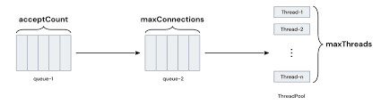

# 1. Thread Pool

## 1-1. Thread

- 프로세스 내 존재하는 실행 단위 → 스레드가 여러 개이기 때문에 동시작업 가능
- CPU의 실행 단위
- 실행 코드의 논리적 단위이므로 정해진 크기 X
- 스레드는 프로세스 내에서 `stack` 영역만 따로 할당 받고 `code`, `data`, `heap` 영역은 다른 스레드와 공유 → `heap` 영역에 있는 인스턴스 변수 (=임계 영역의 공유 자원) 를 스레드끼리 공유할 때 문제가 발생할 수 있음

## 1-2. Thread Pool

- 프로그램 실행에 필요한 스레드를 미리 생성해두는 것
- 스레드 생성 비용을 줄이기 위함
    > Tomcat 3.2 이전 버전에서는 요청이 들어올 때마다 요청을 처리할 스레드를 생성하고 요청이 끝나면 파괴했음 → 다중 요청이 들어올 경우 서버가 일시 다운되는 문제 발생


### Thread Pool 동작 과정



1. 첫 요청이 들어오면 core size (`threads.min-spare`) 만큼 idle 상태의 스레드 생성
    - 처리할 수 있는 요청은 `max-connections` 설정 값 만큼 가능
2. idle 상태의 스레드가 들어오는 요청을 처리
    - idle 상태의 스레드가 없으면 요청을 처리하기 위해 `threads.max` 설정 값만큼 스레드를 생성
3. `max-connections` 이상의 요청이 들어오면 작업 큐에 대기
    - 작업 큐 사이즈는 `accept-count` 설정으로 관리
4. 작업 큐가 가득 차면 connection-refused 오류 반환

### Q. `max-connections` 랑 `threads.max` 랑 뭐가 다른가

- `max-connections`
    - Tomcat이 동시에 열 수 있는 최대 TCP 연결 수
    - 커널 수준에서 소켓 연결이 유지되는 개수의 상한
    - HTTP Keep-Alive처럼 요청이 끝나도 연결을 계속 유지할 수 있으므로 연결 수는 요청 처리 중인 스레드 수보다 훨씬 많을 수 있음
        - 1개의 연결에서 여러 요청이 순서대로 처리될 수도 있고, 대기 중인 연결들은 연결 수(max-connections)에는 포함되지만 스레드는 점유하지 않을 수 있음
    - 이 수치를 넘으면 새로운 연결을 거부되거나 큐(accept-count)에 대기하게 된다.
    - 예를 들어, max-connections 설정값이 8192이면, 동시에 최대 8192개의 TCP 연결을 열 수 있다는 뜻이고, 그중 일부만 실제로 스레드가 붙어 요청을 처리중일 수 있다.


- `threads.max`
    - 요청을 실제로 처리하는 최대 스레드 수
    - 톰캣의 Request Processing Thread Pool(Executor) 안에서 동시에 요청을 처리할 수 있는 스레드 개수의 상한을 의미
    - 요청이 들어오더라도 현재 모든 스레드가 작업 중이면 그 요청은 큐에서 대기

### Q. 스레드를 많이 만들어둘수록 좋은 것 아닌가?

스레드 개수를 늘리면 더 많은 요청을 동시에 처리 가능한 것 아닌가? 하는 의문이 들 수 있으나 실제로는 CPU, 메모리, 컨텍스트 스위칭 때문에 임계점(threshold)을 넘기면 성능이 급격히 나빠진다.

Tomcat의 threads.max는 자바 스레드 풀 내부에서 관리되지만 이는 곧 `JVM` → `OS` → `커널 스레드` 로 매핑된다. 즉, threads.max를 1000으로 늘린다 = 커널 스레드가 1000개 생긴다

1. **Context Switching Overhead**
    > CPU는 한번에 하나의 스레드만 실행 가능하므로 스레드가 너무 많으면 스레드를 계속 전환하느라 “진짜 일”을 하는 시간이 줄어든다. 문맥 전환 시 CPU는 현재 스레드의 레지스터, 캐시 등을 저장하고 다음 스레드의 상태를 로드해야하므로 비용이 크다.

2. **Stack Memory Overhead**
    > 자바 스레드 1개 생성시 기본 스택 메모리 1MB가 할당된다. 즉, 1000개의 스레드가 생성될 시 최소 1GB의 메모리가 소모되는 것 (실제 요청 처리 객체 + 버퍼까지 고려하면 훨씬 많음) 인데, 이 경우 나머지 애플리케이션 메모리가 줄어들어 GC 빈도 증가, OOM 위험이 생긴다.

3. **GC 및 Lock 경합 문제**
    > 스레드가 많으면 각 스레드가 사용하는 객체 수도 증가하는데, 따라서 GC가 더 자주 발생하며 심할 경우 Stop-the-world 시간 증가로 응답 지연이 생긴다. 또한, 여러 스레드가 공유 자원을 다룰 때 락 경합이 심해져 스레드가 대기 상태로 머무는 비율이 높아진다.

4. **I/O Blocking 시 비효율**
    > 요청 중 상당수는 DB, 외부 API 호출 등으로 대기하는 시간인데, 스레드가 많을수록 대기 상태 스레드도 늘어나서 CPU는 한가한데 스레드는 꽉 찬 상황이 자주 발생한다. → 이럴 땐 스레드를 늘리는 대신 NonBlocking I/O, WebFlux 를 고려해야함


## 1-3. 스프링 부트와 톰캣

- 스프링 부트는 내장 서블릿 컨테이너로 Tomcat 지원 → 내장되어있는 톰캣에서 (멀티 스레드를 이용해) 다중 요청을 처리해줌
- application.yml 설정 파일에서 스레드 설정 변경 가능

    ```yaml
    #default 값
    
    server:
      tomcat:
        accept-count: 100 #작업 큐 사이즈
        max-connections: 8192
    		
        threads:
          	max: 200
    		min-spare: 10
    ```


# 2. Connection Pool

## 2-1. Connection Pool

- 커넥션 객체를 미리 만들어두고 재사용하는 개념. DB 요청이 들어오면 커넥션을 빌려주고 처리가 끝나면 다시 반납받아 pool에 저장하는 방식
- 커넥션 객체 생성 비용을 줄이기 위함

## 2-2. DBCP (Database Connection Pool)

- 커넥션 풀을 관리하는 구현체
- 커넥션 풀 생성 및 관리, 커넥션 대여 및 반납 관리, 유효 커넥션 검사, 비정상 커넥션 제거 등의 역할
- 대표 구현체 | `Apache Commons DBCP`, `HikariCP`

### Connection Pool 동작 과정

1. WAS 실행 시 DBCP가 N개의 DB 커넥션을 미리 생성
2. 요청 발생 시 풀에서 커넥션을 하나 대여
3. 쿼리 실행 후 `close()` 호출
4. 커넥션이 풀로 반환
5. 다음 요청에서 재사용

### Q. 적당한 커넥션 개수?

- 커넥션의 개수를 너무 적게 잡으면 → 요청 대기 발생 → 처리량 저하
- 커넥션의 개수를 너무 많게 잡으면 → 리소스 낭비, DB 부하, 문맥 교환 증가
    - DB 서버는 동시에 유지 가능한 세션 개수에 한계가 있음도 고려 (MySQL의 기본 설정은 151개)

# 3. Thread Pool과 Connection Pool

- WAS의 스레드 개수를 보통 커넥션 풀의 개수보다 여유롭게 잡는데, 이는 애플리케이션에 대한 모든 요청이 DB 접근을 요구하지 않기 때문!

# 4. Reference

https://velog.io/@mooh2jj/Tomcat-Thread-Pool-%EC%A0%95%EB%A6%AC

[https://velog.io/@myspy/스프링부트-스레드](https://velog.io/@myspy/%EC%8A%A4%ED%94%84%EB%A7%81%EB%B6%80%ED%8A%B8-%EC%8A%A4%EB%A0%88%EB%93%9C)

https://kiyeon.tistory.com/34

